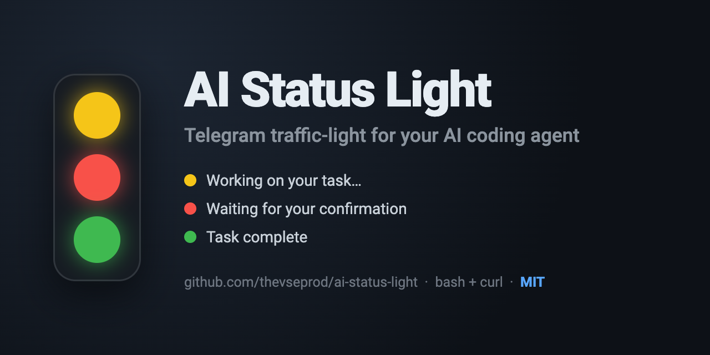
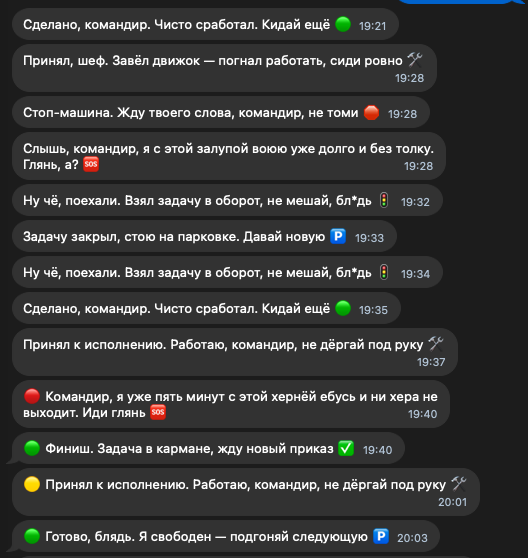

# 🚦 AI Status Light

[](https://github.com/thevseprod/ai-status-light/actions/workflows/shellcheck.yml)
[](LICENSE)
[](https://github.com/thevseprod/ai-status-light/releases)
[](https://github.com/thevseprod/ai-status-light/stargazers)

**[Русский](#русский)** · **[English](#english)**



Telegram-уведомления о состоянии твоего **ИИ-агента для кодинга** — как светофор.
Отошёл от компьютера, но всё равно знаешь, чем он занят. Без кнопок, крошечный, без зависимостей кроме `bash` + `curl`.

Вот что прилетает в Telegram:

> 🟡 Working on your task…
> 🔴 Waiting for your confirmation
> 🟢 Task complete

Готовая интеграция — для **Claude Code**. Ядро от агента не зависит, поэтому легко адаптируется под любого (Codex, Cursor, Aider и др.).

---

## Русский

### ⚡ Быстрый старт
```bash
git clone https://github.com/thevseprod/ai-status-light.git
cd ai-status-light
bash install.sh          # спросит токен и chat_id, пришлёт тест
```
Затем включи хуки в Claude Code (`/hooks` или перезапуск) — и всё. Подробности ниже.

### Как работает
Бот ловит события агента и шлёт цветное сообщение в Telegram. Готовый рецепт — для Claude Code:

| Сигнал | Что значит | Источник (Claude Code) |
|--------|-----------|------------------------|
| 🟡 | Работаю над задачей | хук `UserPromptSubmit` |
| 🔴 | Жду твоего подтверждения | хук `Notification` |
| 🔴 | Слишком долго не могу решить (затык) | фоновый сторож |
| 🟢 | Готово, свободен | хук `Stop` |

### Требования
- аккаунт Telegram
- оболочка с `bash` и `curl`:
  - **macOS / Linux** — работает из коробки
  - **Windows** — через **WSL** (рекомендуется) или **Git Bash**. Уведомления работают; фоновый сторож надёжнее под WSL.

### Установка вручную (для Claude Code)
Если не хочешь `install.sh`:
1. **Создай бота:** [@BotFather](https://t.me/BotFather) → `/newbot` → скопируй токен.
2. **Создай конфиг:** `cp .env.example .env`
3. **Впиши токен** в `.env` в поле `TELEGRAM_BOT_TOKEN=`. **Никогда не коммить `.env`.**
4. **Узнай chat_id:** напиши боту любое сообщение (`/start`), затем запусти
   `bash scripts/get_chat_id.sh` и впиши id в `TELEGRAM_CHAT_ID=`.
5. **Проверь:** `bash scripts/notify.sh green`.
6. **Включи хуки:** `.claude/settings.json` уже настроен. Перезапусти Claude Code (или `/hooks`).
7. **Запусти сторож** (по желанию): `nohup bash scripts/watchdog.sh >/dev/null 2>&1 &`

### Другие агенты (Codex, Cursor, Aider…)
Ядро `scripts/notify.sh` ни от какого агента не зависит — это просто «отправь статус в Telegram»:
```
bash scripts/notify.sh yellow   # начал работу
bash scripts/notify.sh red      # ждёт тебя
bash scripts/notify.sh green    # закончил
```
Чтобы подключить своего агента, дёрни эти команды на его событиях «начал / ждёт / закончил». Самый простой путь — **скормить этот репозиторий своему ИИ-агенту и попросить подцепить `notify.sh` к его хукам**.

### Настройка сообщений
Все фразы — в `phrases/*.txt` (одна строка = одна фраза, выбирается случайно). Меняй тон и язык как захочешь.

**Свой приватный набор, который не уйдёт в git?** Положи файлы с теми же именами в `phrases/custom/` — у них приоритет, и они скрыты от git.

Тон — какой захочешь: хоть строгий, хоть с характером. Пример набора «с характером»:



### Конфиг
- `STUCK_THRESHOLD_MINUTES` в `.env` — через сколько минут затыка слать 🔴 (по умолчанию `5`).

### Безопасность
- Токен и chat_id — **только** в `.env` (скрыт от git). В репозиторий уходит лишь `.env.example` с фейками.
- Утёк токен — отзови в [@BotFather](https://t.me/BotFather) (`/revoke`) и впиши новый.

### Выключить
Убери хуки (`/hooks`) и останови сторож: `pkill -f watchdog.sh`.

### Лицензия
[MIT](LICENSE) — бери, меняй, используй.

### Автор
Пишу и показываю про VSЁ о нейросетях, ИИ-агентах и вайбкодинге - для облегчения жизни и заработка:

- 📢 Telegram: [@buyonhigh](https://t.me/buyonhigh)
- ▶️ YouTube: [@thevseproduction](https://www.youtube.com/@thevseproduction)

---

## English

Telegram notifications about your **AI coding agent**'s state — like a traffic light.
Step away from your machine and still know what it's doing. No buttons, tiny, zero dependencies beyond `bash` + `curl`.

Here's what lands in Telegram:

> 🟡 Working on your task…
> 🔴 Waiting for your confirmation
> 🟢 Task complete

Ready-made integration is for **Claude Code**. The core is agent-agnostic, so it adapts to any agent (Codex, Cursor, Aider, etc.).

### ⚡ Quickstart
```bash
git clone https://github.com/thevseprod/ai-status-light.git
cd ai-status-light
bash install.sh          # asks for token & chat id, sends a test
```
Then enable hooks in Claude Code (`/hooks` or restart) — done. Details below.

### How it works
The bot catches your agent's events and sends a colored Telegram message. The ready-made recipe is for Claude Code:

| Signal | Meaning | Source (Claude Code) |
|--------|---------|----------------------|
| 🟡 | Working on your task | hook `UserPromptSubmit` |
| 🔴 | Waiting for your approval | hook `Notification` |
| 🔴 | Stuck on an error too long | background watchdog |
| 🟢 | Done, idle | hook `Stop` |

### Requirements
- A Telegram account
- A shell with `bash` and `curl`:
  - **macOS / Linux** — works out of the box
  - **Windows** — via **WSL** (recommended) or **Git Bash**. Notifications work fine; the background watchdog is more reliable under WSL.

### Manual install (for Claude Code)
If you'd rather not use `install.sh`:
1. **Create a bot:** [@BotFather](https://t.me/BotFather) → `/newbot` → copy the token.
2. **Create config:** `cp .env.example .env`
3. **Add your token** to `TELEGRAM_BOT_TOKEN=` in `.env`. **Never commit `.env`.**
4. **Get your chat id:** message the bot (`/start`), then run
   `bash scripts/get_chat_id.sh` and put the id into `TELEGRAM_CHAT_ID=`.
5. **Test:** `bash scripts/notify.sh green`.
6. **Enable hooks:** `.claude/settings.json` is preconfigured. Restart Claude Code (or `/hooks`).
7. **Start the watchdog** (optional): `nohup bash scripts/watchdog.sh >/dev/null 2>&1 &`

### Other agents (Codex, Cursor, Aider…)
The core `scripts/notify.sh` is agent-agnostic — it just "sends a status to Telegram":
```
bash scripts/notify.sh yellow   # started working
bash scripts/notify.sh red      # waiting for you
bash scripts/notify.sh green    # done
```
Wire your own agent by calling these on its "started / waiting / done" events. Easiest path — **feed this repo to your own AI agent and ask it to hook `notify.sh` into its events**.

### Customize the messages
All phrases live in `phrases/*.txt` — one phrase per line, a random one is picked. Edit freely to change tone or language.

**Want a private set that won't be committed?** Drop files with the same names into `phrases/custom/` — they take priority and are gitignored.

Make the tone whatever you want — dry or full of personality. Example of a custom "personality" set (in Russian):


### Configuration
- `STUCK_THRESHOLD_MINUTES` in `.env` — minutes "stuck" before the 🔴 alert (default `5`).

### Security
- Token and chat id live **only** in `.env` (gitignored). Only `.env.example` (fake placeholders) is committed.
- If your token leaks, revoke it in [@BotFather](https://t.me/BotFather) (`/revoke`) and set a new one.

### Turn it off
Remove the hooks (`/hooks`) and stop the watchdog: `pkill -f watchdog.sh`.

### License
[MIT](LICENSE) — use it, change it, ship it.

### Author
I write and show VSЁ about AI, agents and vibe coding - to make life easier and to earn:

- 📢 Telegram: [@buyonhigh](https://t.me/buyonhigh)
- ▶️ YouTube: [@thevseproduction](https://www.youtube.com/@thevseproduction)
